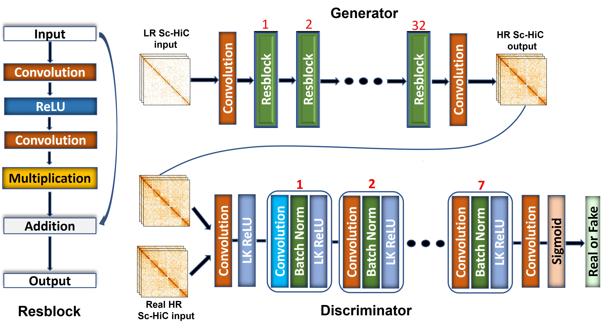

# Single Cell HiC Data Enhancement
Single cell 3D genome modeling tools developed in the Bioinformatics and Machine Learning Lab

<h1 align="center">ScHiCEDRN</h1>




## Description
The directory contains the code used to run the experiments and our own models for the paper

## Developer

```
Yanli Wang
Deparment of Computer Science
Email: yw7bh@missouri.edu
```

## Contact

```
Jianlin (Jack) Cheng, PhD
William and Nancy Thompson Distinguished Professor
Department of Electrical Engineering and Computer Science
University of Missouri
Columbia, MO 65211, USA
Email: chengji@missouri.edu
```

## Content of Folders

```
Model_Weights: Trained weights of all the models used in the paper
Models: Pytorch implementation of models used in experiments
ProcessData: The Raw Data, Data Loaders, and preprcoessing scripts
Pretrain: Scripts used to run experiments and to analyze experiemnt outputs
Utils: Scripts used for loss function and analyze outputs 
```

## Single cell HiC dataset used in the paper

```
The Cooler file dataset for Human cells with GEO number GSE130711 can be get from https://salkinstitute.app.box.com/s/fp63a4j36m5k255dhje3zcj5kfuzkyj1 or more detailed Human single-cell data at https://salkinstitute.app.box.com/s/fp63a4j36m5k255dhje3zcj5kfuzkyj1/folder/82405563291
The Cooler file format dataset for Drosophila was obtained from GEO with code GSE131811 can be get from https://www.ncbi.nlm.nih.gov/geo/query/acc.cgi?acc=GSE131811 
```

## Dependencies

ScHiCedsr is written in Python3 and uses the Pytorch module. 
The dependencies can be installed by the following command:

```
# create conda environment
conda env create -f ScHiCEDRN.yml

# active the environment
conda active ScHiCEDRN
```
## Preparing datasets
```
# First step create folder for the datasets, the 'Datasets' folder should be at the same level as 'TrainingYourData' Folder 
mkdir -p Datasets/Human
# or
mkdir -p Datasets/Drosophila 
```
```
# Second download the dataset to Datasets/Human or Datasets/Drosophila the by the given link
```
```
# Third check the download files' extension, if not .mcool extension, you should zoomify the files to get the resolution you want
cooler zoomify --balance filename.cool
```
```
# Fourth name the zoomified file to the customized name as bellow
mv fiilename.mcool cell1_name.mcool
# note: you can replace the numerical number as any interger you want, and change the 'name' as you want.
```
## Running ScHiCEDRN

If you want to retrain your dataset, YOU can run ScHiCEDRN by the following command:

```
# First step enter the following folder
cd ./TrainingYourData
```
```
# Second step check the envirment whetther it is active, if not active the envirment 
conda activate ScHiCEDRN.yml
```
```
# Third step run the training scripts
python ScHiCedsr_train.py -g [boolean_value] -e [epoch_number] -b [batch_size] -n [cell_number] -l [cell_line] -p [percentage]
```

Optional Parameters:

```
-g, --gan            Choose the model you want to use, '1' means gan that you will use ScHiCedsrgan model to train, '0' indicates you will use ScHiCedsr to train.
-e, --epoch          How many epoches that you want to train.
-b, --batch_size     The batch size you want to use in you model.
-n, --celln          Cell number in the dataset you want to feed in you model.
-l, --celline        Which cell line you want to choose for your dataset, default is 'Human', you should choose one name in ['Human', 'Dros']
-p, --percent        The downsampling ratio for the raw dataset, it should be equal or larger than 0.02 but not larger than 1.0, '1.0' means the input data without any downsampling. 
```
## License
This project is covered under the MIT License.

## Reference
Yanli Wang, Zhiye Guo, & Jianlin Cheng. ScHiCEDRN: Single-cell Hi-C data Enhance-ment with Deep Residual and Generative Adversarial Networks. (Submitted).


